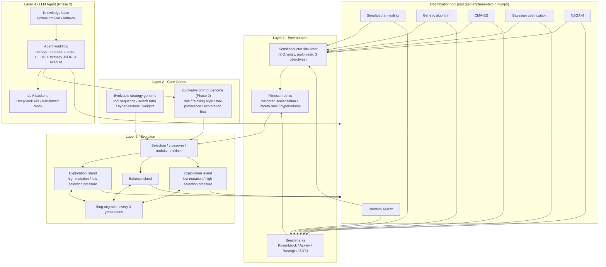
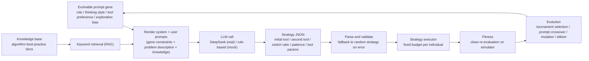

# EvoAgent

> An autonomous evolutionary multi-agent system for semiconductor process optimization (algorithm-verification edition)

EvoAgent uses **evolutionary computation as its core paradigm**: each Agent individual
carries an evolvable *optimization strategy genome* (tool selection, switching timing,
hyper-parameters), and the population continuously evolves better strategies through
selection, crossover, mutation, and island migration.

- **Phase 1 (verified)**: the evolutionary framework vs. classic baselines
  (random search, SA, GA, CMA-ES, Bayesian optimization, NSGA-II).
- **Phase 2 (verified)**: an **LLM Agent layer** where individuals carry an evolvable
  *prompt genome* (role, thinking style, tool preference, exploration bias). The LLM
  generates the optimization strategy from the prompt plus RAG-retrieved knowledge,
  and evolution drives self-improvement of the prompts.

[中文版 README](./README.md)

## Framework overview



### LLM agent workflow (Phase 2)



Mermaid sources: [`docs/framework.mmd`](./docs/framework.mmd), [`docs/llm_agent_workflow.mmd`](./docs/llm_agent_workflow.mmd)

## Core concepts

```
Individual = evolvable strategy genome
  ├── initial_tool / second_tool   two-phase tool choice (RS / SA / GA / CMA-ES / BO)
  ├── switch_after_ratio           when to switch tools
  ├── stop_patience                early-stopping patience
  ├── tool_params                  evolvable tool hyper-parameters
  └── weights (MO mode)            scalarization weight genome

Individual (Phase 2) = evolvable prompt genome
  ├── role                         expert_optimizer / analyst / strategist
  ├── thinking_style               step_by_step / chain_of_thought / tree_of_thought
  ├── tool_preference              cma_es_first / bo_first / ga_first / diversify_first
  ├── stopping_criteria            convergence threshold
  ├── max_iterations               max strategy rounds
  └── exploration_bias             exploration vs. exploitation [0, 1]

Population = 3-island model
  ├── exploration island:  high mutation (0.30) / low selection pressure  -> global search
  ├── balance island:      medium mutation (0.15)
  └── exploitation island: low mutation (0.05) / high selection pressure  -> local refinement
  └── ring migration: every 3 generations, exchange top individuals to avoid premature convergence
```

Each individual executes one complete optimization run on the target problem with a
**fixed evaluation budget** (same unit of cost as baselines); its fitness is the
outcome of executing that strategy. The evolutionary loop improves strategy quality
generation over generation.

## Quick start

```bash
pip install -r requirements.txt

# run unit tests
python -m pytest tests/ -v

# single evolution run (convergence curves + result files)
python experiments/run_evolution.py --problem semiconductor

# full Phase-1 verification (4 single-objective + 2 multi-objective problems, 3 seeds)
python experiments/compare_baselines.py --seeds 3

# Phase 2: LLM prompt evolution (mock LLM by default - reproducible, zero cost)
python experiments/run_llm_agent.py --llm mock --seeds 3

# use the real DeepSeek API (configure .env first, see .env.example)
python experiments/run_llm_agent.py --llm real --seeds 1
```

Results go to `data/results/`:
- `summary.md` / `summary.json`: auto-generated reports (with conclusions)
- `*_convergence.png`, `mo_*_pareto_*.png`: charts
- `*_curves.csv`: mean convergence curve data

Regenerate the README figures at any time:

```bash
python experiments/make_readme_figures.py
```

## Verification results

### Phase 1 - single objective (mean clean fitness, higher is better, 3 seeds)

| Problem | EvoAgent | Best baseline | Improvement |
|---------|----------|---------------|-------------|
| semiconductor (simulator) | **0.0746** | cma_es 0.0667 | +11.8% |
| rosenbrock | **-19.9** | cma_es -126.3 | +84.3% |
| ackley | **-0.79** | cma_es -3.40 | +76.7% |
| rastrigin | **-4.03** | cma_es -15.26 | +73.6% |


### Phase 1 - multi-objective (hypervolume, higher is better)

| Problem | EvoAgent | NSGA-II baseline | Improvement |
|---------|----------|------------------|-------------|
| zdt1 | **0.9951** | 0.9442 | +5.4% |
| semiconductor_2obj | **0.1417** | 0.1214 | +16.7% |


### Phase 2 - LLM prompt evolution (2026-08-14, mock LLM, 3 seeds)

Semiconductor problem, weights [0.5, 0.3, 0.2], identical LLM-call count per mode
(8 individuals x 11 generations = 88 calls), strategy budget 300 evals per individual:

| Mode | Mean | Std |
|------|------|-----|
| llm_evolve (evolved prompts) | **0.0728** | 0.0040 |
| llm_fixed (fixed prompt) | 0.0694 | 0.0023 |
| phase1 (no LLM) | 0.0647 | 0.0102 |


**Conclusion**: evolved prompts beat the fixed-prompt baseline by **+4.9%** with an
identical number of LLM calls (the only difference is prompt-gene evolution), and the
LLM + RAG strategy generation overall outperforms the Phase-1 no-LLM framework with
lower variance across seeds. The evolved best prompts converge toward combinations
such as `bo_first / chain_of_thought`. Run with `--llm real` (DeepSeek) to reproduce
the same pipeline with a real model.

### Comparison methodology

- Baselines: one fixed-budget run of 800 evaluations.
- EvoAgent: 3 islands x 8 individuals x 10 generations, **strategy budget 300 evals
  per individual** (same unit cost as a baseline run); the population trades parallel
  strategy attempts + evolutionary selection for higher sample efficiency and stability.
- The semiconductor problem includes Gaussian measurement noise (yield sigma = 0.02);
  reported metrics are re-evaluated on the noise-free function.
- Phase 2: both LLM modes make the same number of LLM calls per seed
  (`population_size x (generations + 1)`), isolating the effect of prompt evolution.

## Related work

EvoAgent belongs to the "LLM + evolutionary computation" line of research and borrows
from the following works: island models, operator-based mutation, strategy/prompt
evolution, and memory management.

| Project | Origin | Focus | Relation to EvoAgent |
|---------|--------|-------|----------------------|
| [FunSearch](https://github.com/google-deepmind/funsearch) | Google DeepMind (*Nature* 2023) | Program search via LLM + evolution | A conceptual source of island evolution: 10 islands, cluster softmax sampling, temperature annealing and periodic reset to avoid premature convergence (mirrored in EvoAgent's exploration/exploitation islands) |
| [EoH](https://github.com/FeiLiu36/EoH) | Huawei Noah's Ark Lab + CityU HK (ICML 2024) | Automatic heuristic design with LLM + evolution; dual code-and-idea representation | Closest to the spirit of Phase 2 (LLM evolving solving strategies); its operator-based mutation (e1/e2/m1/m2/m3) and subprocess-isolated evaluation are directly portable to EvoAgent's prompt-gene mutation |
| [OpenEvolve](https://github.com/algorithmicsuperintelligence/openevolve) | Open-source implementation of AlphaEvolve (7k+ stars) | Full framework: island evolution + LLM integration + multi-objective + evaluation pool + checkpoints | Architecturally very similar (islands/migration/LLM-generate-then-evaluate loop); its three-way parent sampling, MAP-Elites feature coordinates, cascade evaluation and full-state checkpoints are the main references for EvoAgent's next phases |
| [EvoAgentX](https://github.com/wssnail/EvoAgentX) | Community open-source | Self-evolving agent workflows integrating TextGrad / MIPRO / AFlow / SEW / EvoPrompt | Same vein of prompt/workflow evolution: combinatorial evaluation, per-node populations and graph-level workflow optimization serve as templates for Phase 3 (LangGraph orchestration) and meta-level search |
| [SCOPE](https://github.com/JarvisPei/SCOPE) | Academic open-source | Evolving agent prompts from execution trajectories; tactical/strategic dual-stream memory | A reference for prompt-gene evolution: Generator + Selector (Best-of-N) synthesis and a memory optimizer (conflict resolution / subsumption pruning / consolidation), applicable to meta-level hyper-parameter rule accumulation in EvoAgent |

> All repositories above are forked to [github.com/luxus0946](https://github.com/luxus0946)
> and studied locally; a detailed architecture comparison is kept in `C:\code\EvoAgentRefs`.

## Code structure

```
evoagent/
├── environment/   # Layer 1: semiconductor simulator + standard benchmarks + fitness (weighted / Pareto / HV)
├── core/          # Layer 2: Agent individual + evolvable strategy genome + evolvable prompt genome
├── evolution/     # Layer 3: operators, population, strategy executor, island model, loop + LLM prompt population
├── agent/         # Layer 4 (Phase 2): LLM client (OpenAI / mock), prompt templates, strategy generator, RAG KB, workflow
├── tools/         # tool pool: random search / SA / GA / CMA-ES / BO / NSGA-II (self-implemented in numpy)
├── config.py      # global configuration (incl. LLMConfig)
└── utils/         # logging, random seeds, visualization
experiments/       # run_evolution / compare_baselines / run_llm_agent / make_readme_figures
tests/             # 73 unit tests (24 for the Phase-2 agent layer)
docs/              # Mermaid framework diagrams
figures/           # charts used by this README
```

## Roadmap

- [x] Phase 1: core evolutionary framework (environment / genes / operators / population / islands / tool pool)
- [x] Phase 1 verification: single-objective + Pareto multi-objective experiments and report
- [x] Phase 2: LLM Agent layer (OpenAI-compatible DeepSeek) + evolvable prompt genome
- [x] Phase 2 verification: prompt evolution vs. fixed prompt vs. Phase 1 (same LLM-call budget)
- [ ] Phase 3: LangGraph orchestration, meta-level hyper-parameter search (Bayesian), PPO tool integration
- [ ] Phase 4: FastAPI + Gradio + Docker

## Reproducibility

- Every experiment records its random seed; repeated runs with the same configuration
  produce identical results (verified).
- Comparison experiments use the same seed sequence.
- The noise model is deterministic (each parameter point has a fixed measurement noise),
  so results are exactly reproducible.